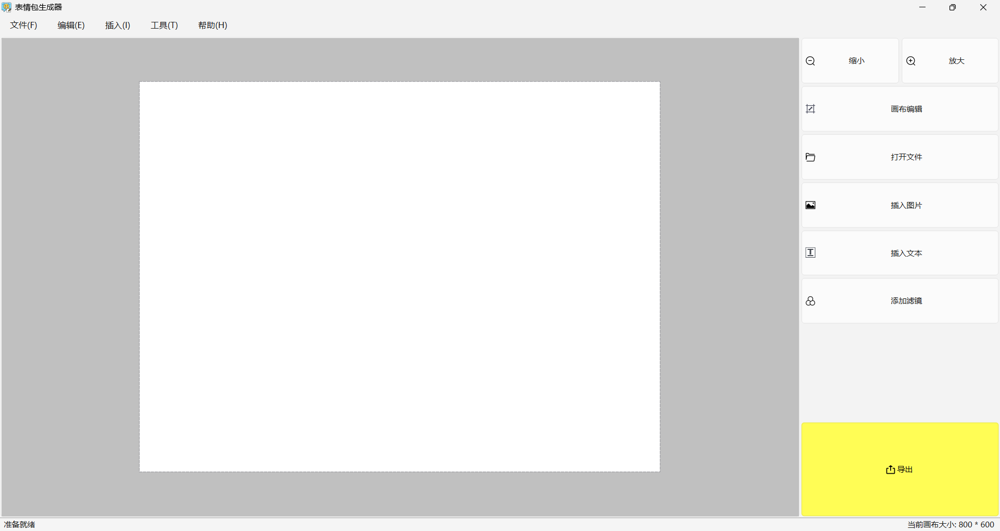
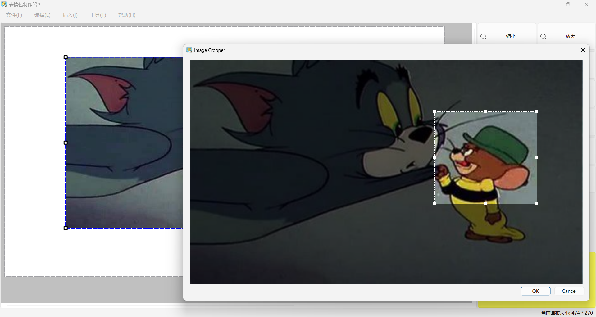
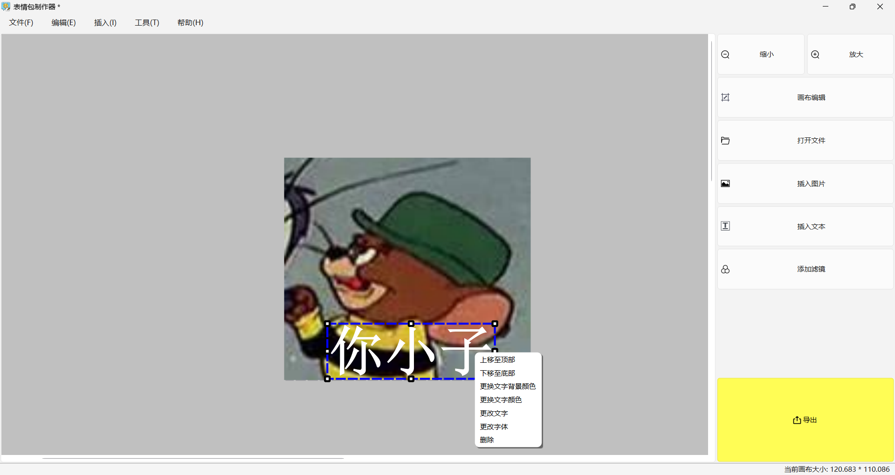
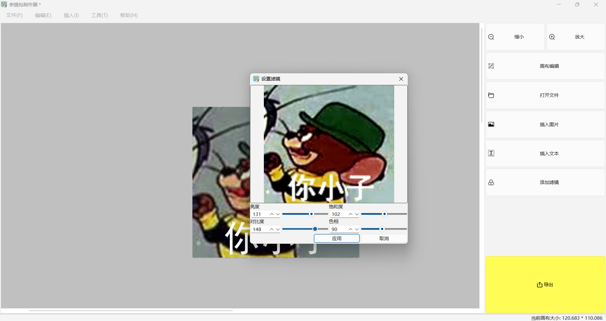

# <center>MemeGenerator  表情包生成器

一款基于Qt框架开发的跨平台表情包生成工具，支持图片编辑、文本添加、滤镜效果、裁剪缩放等功能，操作简单直观。



## 功能特性

### 图片编辑
- **多图叠加**：支持在画布上叠加多张图片
- **自由拖拽**：通过拖拽调整图片位置和大小
- **图层管理**：调整图片的叠放顺序（置顶/置底）
- **裁剪功能**：精确裁剪图片区域
- **滤镜效果**：多种图像滤镜（灰度、反色、模糊等）

### 文本编辑
- **动态文本**：添加可编辑的文本元素
- **字体自定义**：支持字体、大小、颜色设置
- **文本拖拽**：自由调整文本位置和大小

### 画布管理
- **画布编辑模式**：切换画布编辑状态
- **画布尺寸调整**：自定义画布大小
- **缩放视图**：支持缩放查看

### 操作管理
- **撤销/重做**：完整的命令模式实现
- **复制/粘贴**：支持元素复制粘贴
- **删除元素**：删除选中的图片或文本

## 快速开始

### 系统要求
- **操作系统**：Windows / Linux / macOS
- **开发环境**：Qt 6.10+，MinGW (Windows) 或 GCC (Linux/macOS)
- **C++标准**：C++17

### 从源码构建

```bash
# 克隆仓库
git clone https://github.com/l-library/MemeGenerator.git
cd MemeGenerator

# 使用qmake构建
qmake MemeGenerator.pro
make

# Windows使用MinGW
qmake MemeGenerator.pro
mingw32-make
```

### 直接下载
从 [GitHub Releases](https://github.com/l-library/MemeGenerator/releases) 下载预编译版本。

## 部分功能预览

| 功能     | 截图                                   |
| -------- | -------------------------------------- |
| 初始界面 |        |
| 裁剪功能 |        |
| 文本编辑 |  |
| 滤镜效果 |        |

## 项目结构

```
MemeGenerator/
├── main.cpp              # 程序入口
├── mainwindow.cpp/h     # 主窗口实现
├── resizableitem.cpp/h  # 可调整大小的图形项
├── commands.cpp/h       # 命令模式实现（撤销/重做）
├── filterdialog.cpp/h   # 滤镜对话框
├── imagecropperlabel.cpp/h # 图片裁剪组件
├── menuconfig.cpp/h     # 菜单配置管理
├── dimoutsidecanvaseffect.h # 画布外区域变暗效果
├── MemeGenerator.pro    # Qt项目文件
├── images.qrc          # 资源文件
└── screenshots/        # 软件截图
```

## 技术架构

### 核心设计模式
- **命令模式**：实现完整的撤销/重做系统
- **观察者模式**：Qt信号槽机制
- **组合模式**：图形项管理

### 关键组件
1. **MainWindow**：主窗口，管理所有UI组件和业务逻辑
2. **ResizableItem**：可调整大小的图形项基类，支持拖拽和缩放
3. **QUndoStack**：Qt内置的撤销栈，配合自定义命令类
4. **QGraphicsView/Scene**：Qt图形视图框架，提供2D图形渲染

### 命令系统
项目实现了完整的命令模式，包含以下命令类：
- `AddItemCommand` / `DeleteItemCommand` - 添加/删除元素
- `MoveItemCommand` / `ResizeItemCommand` - 移动/调整大小
- `ChangePixmapCommand` / `ChangeTextCommand` - 修改图片/文本
- `CanvasResizeCommand` / `CanvasMoveCommand` - 画布操作
- `CompositeCommand` - 组合命令

## 开发计划

### 已实现功能
- [x] 图片导入与多图叠加
- [x] 文本添加与编辑
- [x] 滤镜效果（灰度、反色、模糊等）
- [x] 图片裁剪与缩放
- [x] 撤销/重做系统
- [x] 图层管理（置顶/置底）

### 计划中功能
- [ ] 背景去除（抠图）
- [ ] 文字气泡模板
- [ ] 绘图工具（涂鸦、形状）
- [ ] 表情包模板库
- [ ] 多图拼接功能
- [ ] 平台尺寸适配